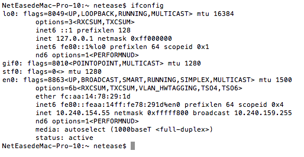
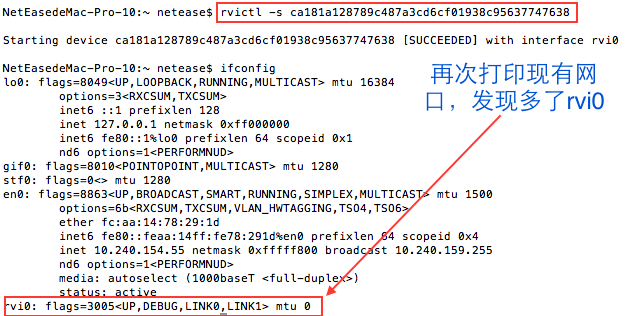
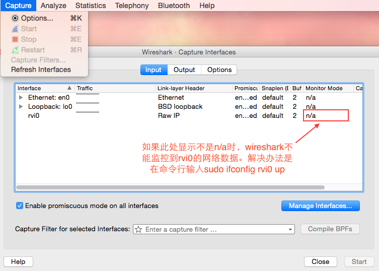
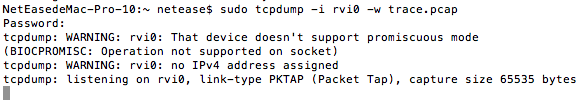
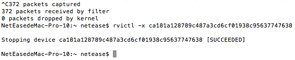
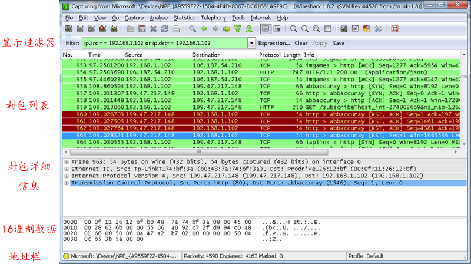
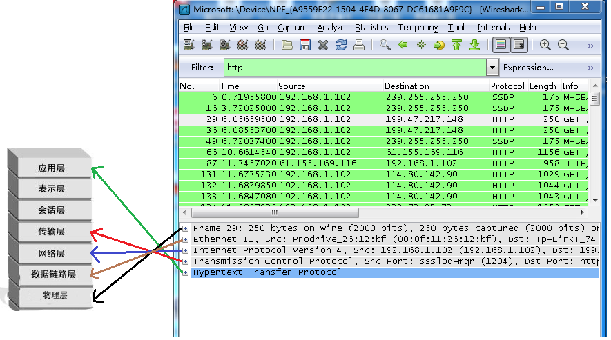
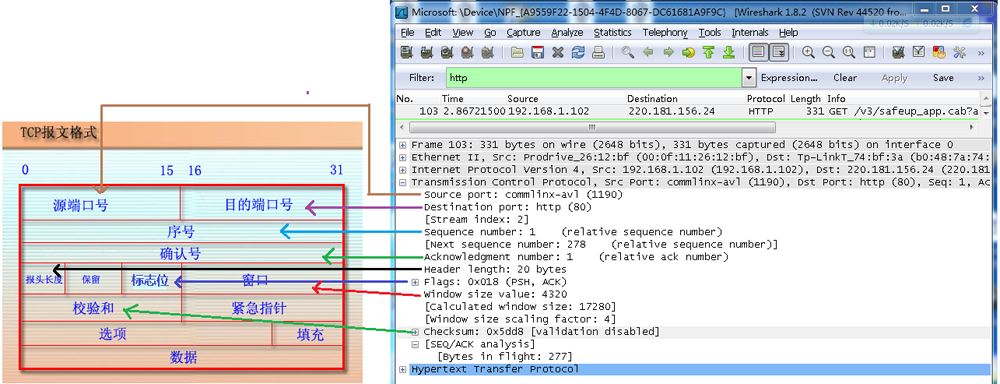

#IOS抓获TCP UDP包

如有建议，请发邮件至[hzzhuzhiqiang@corp.netease.com](hzzhuzhiqiang@corp.netease.com)
 
 本文介绍抓取并查看iPhone上的TCP/IP和UDP包得数据：
 
 1、	使用Remote Virtual Interface抓取iPhone数据包
 
 2、	然后使用Wireshark打开数据包pcap文件
 
##Remote Virtual Interface
参考[苹果开发者文档 Getting a Packet Trace](https://developer.apple.com/library/mac/qa/qa1176/_index.html)

RVI可以抓取IOS设备上的包，使用基本步骤是：
*	将IOS设备通过USB线连接到Mac上
*	给IOS设备设置一个RVI。这样为这个设备在Mac上创建了一个虚拟网络接口，这个接口代表IOS设备的网络通信栈
*	运行OS X包追踪应用，指定抓取RVI。这里使用tcpdump实施抓取

###使用rvictl
先打印现有网口



取得IOS设备码（打开Xcode，Window->Device,选中当前设备，identify内容即为设备UUID）

运行rvitcl工具

```
rvictl -s ca181a128789c487a3cd6cf01938c95637747638
```



移除rvictl中的设备的命令是

```
rvictl -x ca181a128789c487a3cd6cf01938c95637747638
```

###使用抓包工具从rvi获取数据
####Wireshark
抓包工具首选wireshark，它可以实时显示抓取数据，功能强大兼使用方便，安装方法见末尾。  
要获取rvi的数据，需要在wireshark中选择Capture->Options，这时可以看到rvi0这个网卡。  
如果rvi0的Monotor Mode显示为n/a，表示可用，如果不是，则需要在命令行中打开rvi0：  
`sudo ifconfig rvi0 up`。  
然后点击Start久开始实时获取设备的网络包了。


####tcpdump
使用tcpdump工具监测包数据根据rvi的名字获取数据包，并且将包写入trace.pcap文件：

```
sudo tcpdump -i rvi0 -w trace.pcap
```


现在就开始抓取TCP和UDP包了，结束时按Ctrl+C关闭，所有的数据会存储在用户目录下的trace.pcap


pcap格式的数据文件可以使用文字编辑软件打开，但是由于格式乱，可读性差。
可以在wireshark中选择File->Open,选中用户目录下的trace.pcap文件，打开后就可以方便地查阅包数据了。


------

##Wireshark
参考[Wireshark基本介绍和学习TCP三次握手](http://www.cnblogs.com/TankXiao/archive/2012/10/10/2711777.html#cannotdo)

[Wireshark下载地址](https://2.na.dl.wireshark.org/osx/Wireshark%201.99.6%20Intel%2064.dmg)

wireshark是一个非常好用的抓包工具，用来获取网络数据封包，包括http,TCP,UDP等网络协议包**wireshark 是学习网络协议最好的工具**

使用前提：必须了解网络协议，否则就看不懂wireshark了

原理：wireshark是捕获机器上的某一块网卡的网络包，当你的机器上有多块网卡的时候，你需要选择一个网卡。
###打开pcap文件

Wireshark的Filter提供条件查阅功能，使用例子：

*	ip.src == 10.240.154.55 && ip.dst == 192.168.130.33

	特定发送IP和接收IP的筛选

*	ip.src == 10.240.154.55 && http

	特定发送IP，并且是HTTP请求

*	ip.src == 10.240.154.55 && tcp.flags

	特定发送IP，并且是TCP请求
	
###抓取当前网卡的数据包
选择Capture->Options，弹出网卡选择界面


选中en0这个常用网卡，点击开始就开始了对TCP包得获取



wireshark与对应的OSI七层模型



TCP包的具体内容




