#Network Link Conditioner模拟不同网络环境

如有建议，可发邮件至[hzzhuzhiqiang@corp.netease.com](hzzhuzhiqiang@corp.netease.com)

Network Link Conditioner是一个工具，可以让用户模拟不同的网络连接和带宽，可供Mac和iOS开发者测试自己的程序在不同网络环境下的表现。

##MAC上的使用方法

 安装文件在此文同级目录下。下载到本地了，可点击[Network Link Conditioner.prefPane](Resources/NetworkLink/Network Link Conditioner.prefPane)
 
 Network Link Conditioner会被添加到系统偏好设置的其他分类中
 
 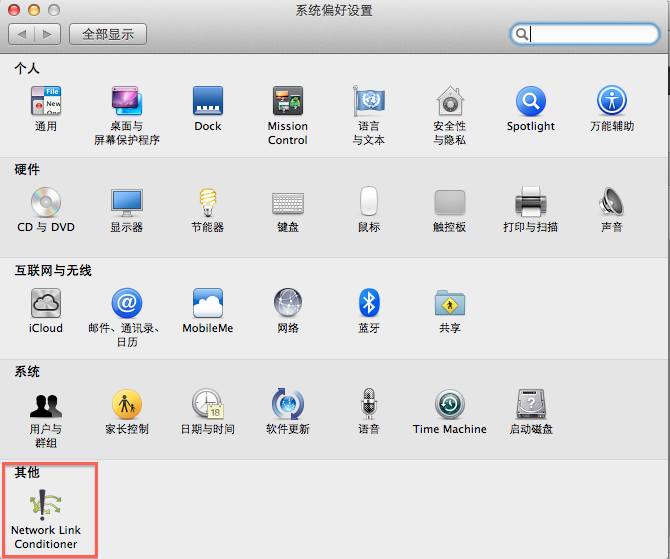
 
 点击打开，Network Link Conditioner界面为
 
 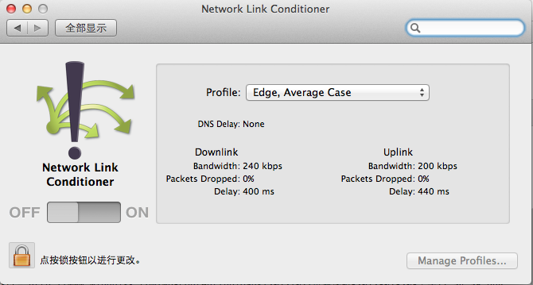
 
 在Profile中包含预置的几种网络环境，包含3G,DSL,Edge,Wifi，每种网络环境对应不同的上下行带宽，丢包率和网络延迟,DNS延迟。
 
 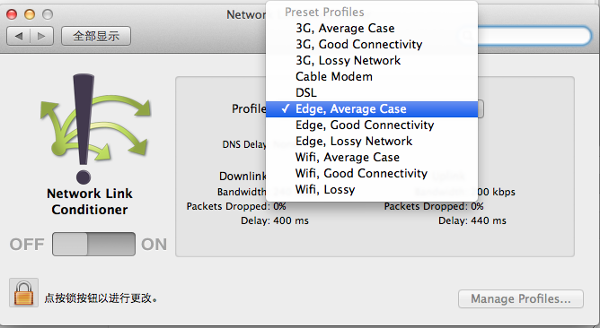
 
 还可以根据需要自定义不同的网络环境，点击左下角锁按钮输入系统密码解锁后，右侧Manage Profiles…就变为可用，点击后可进入管理Profiles窗口,在其中可定义自己需要的Profile.
 
 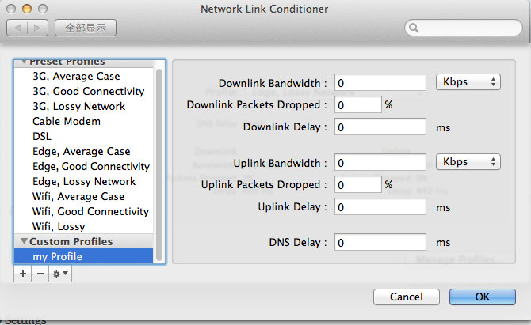
 
  把ON/OFF按钮滑动到ON,即启动了网络模拟器。
  
 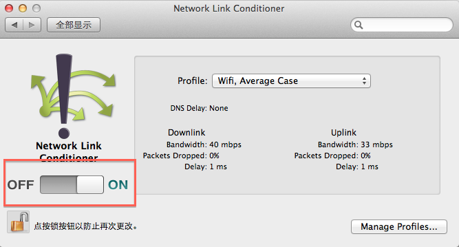
 
 这时在系统右上角会显示图标，可以点击图标取消网络限制或打开Network Link Conditioner重新配置。
 
 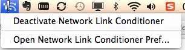
 
 启动Network Link Conditioner就可以使用iOS模拟器测试APP在此种环境下的运行情况了。
在测试完毕时，记得停止Network Link Conditioner，Network Link Conditioners是对整个系统有效的，普通上网的速度也会被限制。

##IOS上的使用方法
打开iPhone的设置，找到开发者

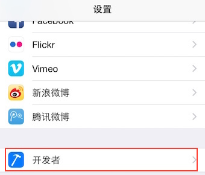

选择Network Link Conditioner

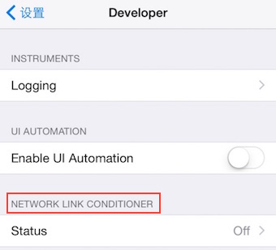

Network Link Conditioner界面为

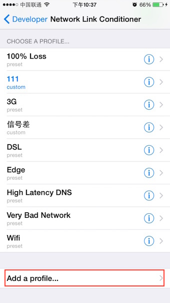

同样预置了几种网络环境，点击add profile添加新的设置

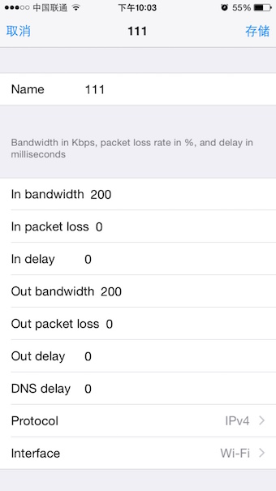

打开Enable开关，启动了网络模拟器

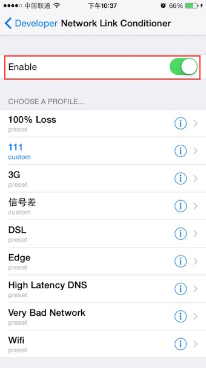

同样，测试完成后记得关掉Network Link Conditioner