# 一、Reveal 简介

Reveal 是一个 iOS UI 调试工具，使用 Reveal 可以在应用运行时方便的查看页面的层级结构，此外，可以在 Reveal 中动态的修改页面中各个控件的背景色、字体大小(可以显示字体的控件，如 UILabel)等样式，并且不需要重新运行程序就可以在 Reveal 中实时看到修改后的效果。

Reveal 既可以查看模拟器上运行的应用程序的页面结构，也可以查看真机上运行的程序的页面结构。

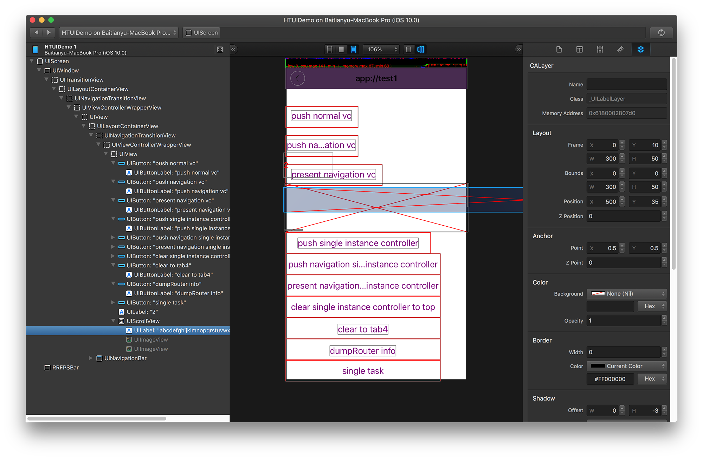

# 二、下载 Reveal

官网地址：[Reveal官网](https://revealapp.com/)

# 三、Reveal 连接模拟器调试

Reveal 官方推荐使用方法中需要修改工程文件，为了减少团队协作开发引起的冲突，应尽量减少工程文件的修改，此处使用不修改工程文件的方式使用 Reveal。Reveal 连接模拟器调试的步骤如下：

## 1. 新建 .lldbinit 文件

在 Home 目录(就是 ~ 目录)下新建 .lldbinit 文件，然后加入下面的内容：

	command alias swift_reveal_load_sim expr dlopen("/Applications/Reveal.app/Contents/SharedSupport/iOS-Libraries/libReveal.dylib", 2)
	command alias swift_reveal_load_dev expr dlopen(NSBundle.mainBundle().pathForResource("libReveal", ofType: "dylib")!, 2)
	command alias swift_reveal_start expr NSNotificationCenter.defaultCenter().postNotificationName("IBARevealRequestStart", object: nil)
	command alias swift_reveal_stop expr NSNotificationCenter.defaultCenter().postNotificationName("IBARevealRequestStop", object: nil)
	command alias objc_reveal_load_sim expr (void*)dlopen("/Applications/Reveal.app/Contents/SharedSupport/iOS-Libraries/libReveal.dylib", 0x2);
	command alias objc_reveal_load_dev expr (void*)dlopen([(NSString*)[(NSBundle*)[NSBundle mainBundle] pathForResource:@"libReveal" ofType:@"dylib"] cStringUsingEncoding:0x4], 0x2);
	command alias objc_reveal_start expr (void)[(NSNotificationCenter*)[NSNotificationCenter defaultCenter] postNotificationName:@"IBARevealRequestStart" object:nil];
	command alias objc_reveal_stop expr (void)[(NSNotificationCenter*)[NSNotificationCenter defaultCenter] postNotificationName:@"IBARevealRequestStop" object:nil];

* **swift\_reveal\_load\_sim** 

为模拟器加载 Reveal 的动态链接库，以便可以用 Reveal 动态调试模拟器运行的应用程序的页面结构。用于 Swift 代码的工程；

* **swift\_reveal\_load\_dev**

为真机加载 Reveal 的动态链接库，以便可以用 Reveal 动态调试模拟器运行的应用程序的页面结构。用于 Swift 代码的工程；

* **swift\_reveal\_start**

启动 Reveal 调试功能；

* **swift\_reveal\_stop**

结束 Reveal 调试功能；

* **objc\_reveal\_load\_sim**

作用与 swift\_reveal\_load\_sim 相同，只不过该命令用于 Obejective-C 代码的工程；

* **objc\_reveal\_load\_dev**

作用与 swift\_reveal\_load\_dev 相同，只不过该命令用于 Obejective-C 代码的工程；

* **objc\_reveal\_start**

作用与 swift\_reveal\_start 相同，只不过该命令用于 Obejective-C 代码的工程；

* **objc\_reveal\_stop**

作用与 swift\_reveal\_stop 相同，只不过该命令用于 Obejective-C 代码的工程；

## 2. 配置断点

在 AppDelegate application:didFinishLaunchingWithOptions: 方法的中，按如下操作：

(1) 在 application:didFinishLaunchingWithOptions: 方法第一行代码前面点击行号添加一个断点，如下图：

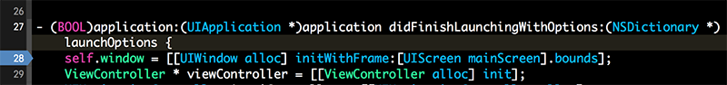

(2) 右键点击断点，选择 "Edit Breakpoint"，如下图：

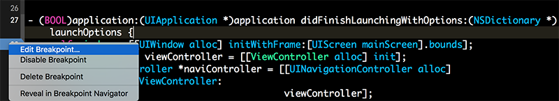

(3) 点击 "Add Action"，然后在 action 下面填入： **objc\_load\_reveal\_sim** ，注意填入的命令和实际需求有关，这里是要用 Reveal 调试模拟器上的 Objective-C 应用，所以选用了 **objc\_load\_reveal\_sim** 。此外，需要勾选中：Options 中的 "Automatically continue after evaluating actions"。

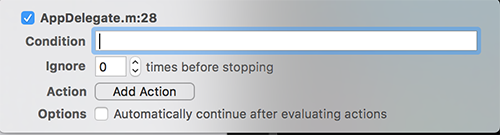

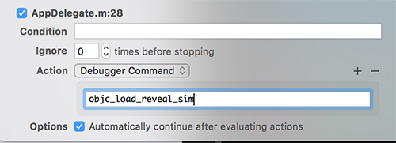

## 3. 运行工程，打开 Reveal 联调

在模拟其中选中一个需要调试的页面，打开 Reveal，在左上角位置选中设备后，即可调试当前页面，当 Reveal 显示出页面结构后，可以选中页面中的任意控件，在 Reveal 右侧的检查器中查看属性值；此外，可以在检查器中修改属性值，并且可以实时看到属性修改后的样式。

注意：运行工程时，注意运行在模拟器还是真机应该与上一步骤中断点添加的 action 对应。

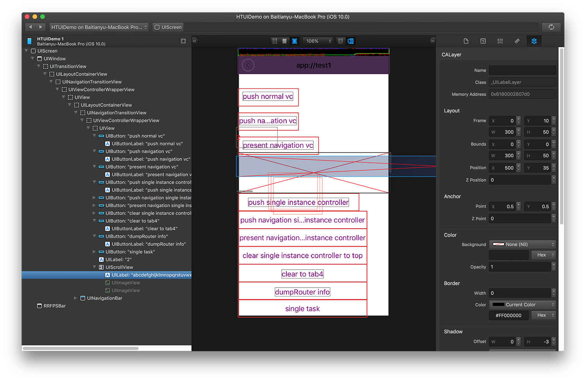

# 四、Reveal 连接真机测试

使用 Reveal 调试应用程序需要使用到 Reveal 的动态链接库，由于真机上并没有 Reveal 动态链接库，所以我们需要将其拷贝到真机上，但是真机的应用程序有沙盒，所以我们只能将动态链接库放入到工程的 "Copy Bundle Resources" 中，具体操作如下：

(1) 打开 Reveal -> 顶部菜单栏 Help -> Show Reveal Library in Finder -> iOS Library

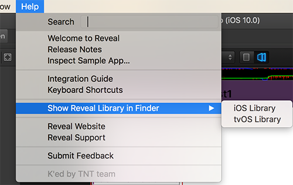

(2) 将 "libReveal.dylib" 拷贝到工程的 Frameworks group 下(当然也可以放在其他 Group 下，比如 Supporting Files)，注意如果是将 "libReveal.dylib" 拖拽到工程，需要选中 "Copy items if needed"。

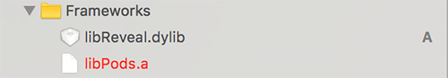

(3) 进入 Target -> Build Phases -> Link Binary With Libraries，将 "libReveal.dylib" 从 "Link Binary With Libraries" 中删除，并将其添加到 Target -> Build Phases -> Copy Bundle Resources 中。

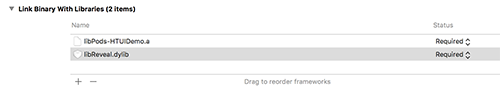

(4) 将"第三步-Reveal 连接模拟器调试"中设置的断点的 action 修改为 **objc\_load\_reveal\_dev** ，将程序运行在真机上后，即可打开 Reveal 在左上角选择真机设备进行页面调试；注意：电脑和手机设备必须处于同一个局域网内，才能使用 Reveal 调试真机应用程序的页面，这一点非常关键，此外如果在真机时无法正常使用 Reveal 调试(比如无法编译运行，运行后无法查看到页面结构)可以参考下一步说明。

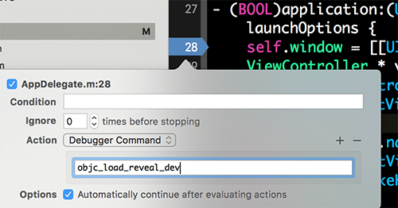

(5) 如果第四步无法正常运行，可以在 Target -> Build Phases -> 添加一个 Run Script，并将以下内容填入：

	set -e

	if [ -n "${CODE_SIGN_IDENTITY}" ]; then
	codesign -fs "${CODE_SIGN_IDENTITY}" "${BUILT_PRODUCTS_DIR}/${FULL_PRODUCT_NAME}/libReveal.dylib"
	fi

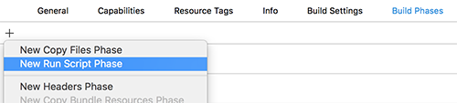

这段代码是对 libReveal.dylib 进行签名，因为 iOS 的安全机制，程序只能运行签过名的代码，所以这里进行一次签名，再次执行第四步即可。

# 五、进阶-使用 Revel 查看任意应用页面结构

在我们看到某个应用复杂页面时，有时会想要了解这个页面的结构是什么样子，这是 Reveal 就可以派上用场了。使用 Reveal 可以查看任意应用的页面结构，包括 iOS 系统本身的应用，但是前提是必须要有越狱的 iOS 设备。下面介绍在越狱设备上查看任意应用页面结构的最简洁的方法。

## 1. 前提

* 必须要有越狱的 iOS 设备；
* iOS 设备必须与电脑处于同一个局域网；
* 电脑需要安装 Reveal

## 2. 配置越狱设备

### (1) 打开 Cydia，等待 Cydia 数据更新完成；

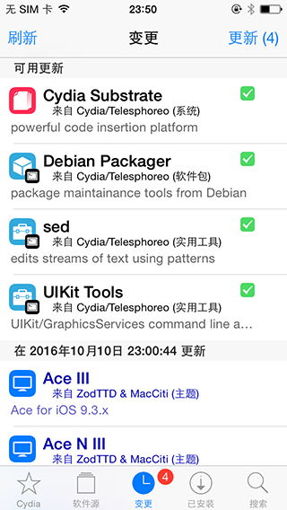

### (2) 点击搜索 Reveal Loader，并进行安装，如下图：

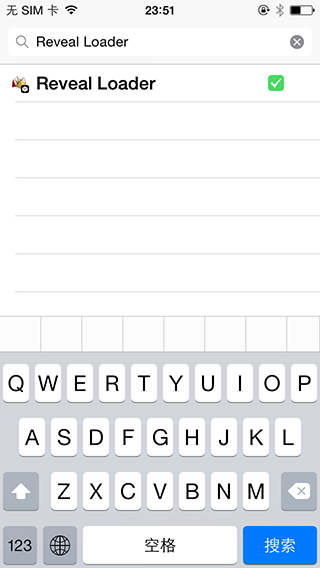

### (3) 安装完成后，系统会提示需要重启 SpringBoard，重启后进入系统设置，在设置中找到 Reveal，然后进入 Enabled Applications 页面，如下图：

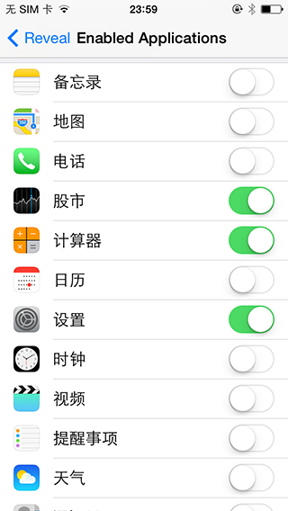

选中需要使用 Reveal 查看的 App。

## 3. 查看应用的页面结构

经过第2步，且 iOS 设备与电脑处于同一局域网时，即可打开 iOS 设备上的在第2步勾选的应用，然后打开电脑的 Reveal，在左上角选择设备进行页面结构的查看，如下图：

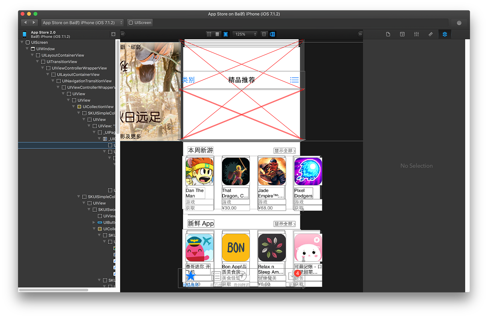

# 六、参考文档

1. [iOS逆向工程之Reveal工具的安装、配置与使用](http://www.cnblogs.com/ludashi/p/5717991.html)

2. [iOS开发中集成Reveal](http://blog.devzeng.com/blog/ios-reveal-integrating.html)
