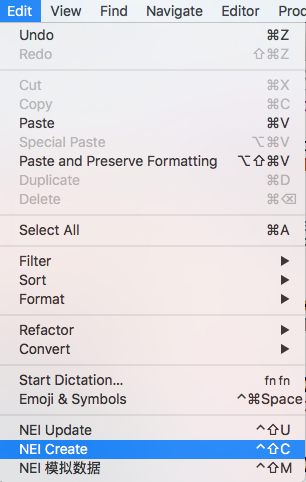

# README

## 插件功能

本Xcode插件是为了在Xcode中集成[nei-toolkit](https://github.com/NEYouFan/nei-toolkit)相关功能而开发, 主要包括以下功能:

1. NEI Create: 选择工程模板来创建工程; 工程模板示例请参见[工程模板](https://g.hz.netease.com/HeartTouchOpen/nei_mobile/tree/master/%E6%A8%A1%E6%9D%BF/%E6%A8%A1%E6%9D%BF%E5%B7%A5%E7%A8%8B/HTDemo)
2. NEI Update: 更新自动生成的网络请求与Model类代码
3. NEI 模拟数据 : 从nei站点上模拟生成对应的JSON文件

## 插件安装与使用说明

### 安装

由于该插件并未提交到github上，因此需要自己使用Xcode安装

1. 下载插件工程
2. 编译运行
3. 重新启动Xcode, 在`Edit`菜单下会看到对应的菜单选项

### 使用

选择对应菜单。

其中: 

1. NEI Create: 必须使用工程模板进行创建；按照提示选择模板文件夹名并填入nei项目名和前缀等信息；
2. NEI Update: 创建和生成网络请求相关代码; 第一次弹出是会要求填写nei项目名和前缀等信息；第一次生成后会在工程目录下生成`neiConfig.json`文件; 该文件内容如下:

		{
	  		"codeGroup" : "YunweiStone\/Network",
	  		"namePrefix" : "YWS",
	  		"projectID" : 12231
		}
	
  其中指明了网络请求代码生成路径、前缀与nei路径等；
  
  如果希望更改这些参数，可以手动修改也可以删除该文件后重新选择`NEI Update`菜单。
  
  手动修改时，可以添加更多nei-toolkit允许的参数，例如
  
		{
	  		"codeGroup" : "YunweiStone\/Network",
	  		"namePrefix" : "YWS",
	  		"reqAbstract" : "HTAutoBaseRequest",
	  		"projectID" : 12231
		}
		
  通过添加`reqAbstract`一栏，指明生成的请求基类不是默认的`HTBaseRequest`，而是`HTAutoBaseRequest`.
  允许的参数请参见`nei-toolkit`的详细说明。
		   
3. NEI 模拟数据 : 从nei站点上模拟生成对应的JSON文件; 该命令仅当`neiConfig.json`文件存在时才有效；所生成的JSON文件会在网络请求与数据模型代码的同一目录下。如果使用最新的工程模板生成工程，会自动带上脚本，将这些JSON文件Copy到bundle中；否则，需要自行处理，比如说将这些JSON文件添加到工程中。
	默认情况下，生成的这些JSON文件的名字不需要变更，和`HTBaseRequest`类中的`defaultMockJsonFilePath`里得到的JSON文件名字一致，这样可以达到这样的目的：不需要手动为每个Request实例指定Mock的JSON文件就可以进行Mock。
	如果有对这些JSON文件更名或者发现与request的`defaultMockJsonFilePath`不一致时，请按照`HTNetworking`的文档指明request模拟数据从哪个JSON文件中来。