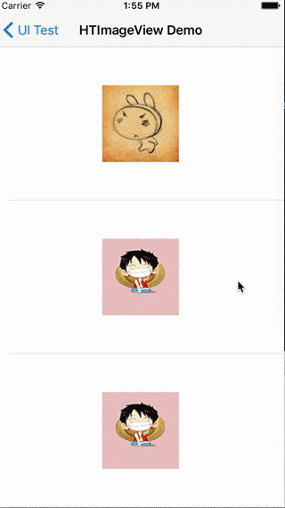

# HTImageView # 
网络图片处理控件，封装于SDWebImage，主要增加一些经常使用的交互需求功能封装。  

## 一、特性 ##

* 提供设置默认图，错误图的统一接口，并且可设置不同模式下的图片的contentMode
* 提供图片的渐现效果
* 提供图层的遮罩效果，可设置颜色及圆角信息
* 提供GIF图的自动播放功能
* 通过url加载图片

## 二、用法 ##

### 设置图片的默认显示和错误显示方式  ###
    [self.imageView setNormalImageContentMode:UIViewContentModeScaleToFill
                               placeHodlerImage:[UIImage imageNamed:@"default.jpg"]
                                    contentMode:UIViewContentModeCenter
                                     errorImage:[UIImage imageNamed:@"error.jpg"]
                                    contentMode:UIViewContentModeCenter];
### 设置图片源  ###
	[self.imageView setImageWithUrl:[NSURL URLWithString:url] options:0
                             progress:^(NSInteger receivedSize, NSInteger expectedSize) {
                                 wself.number.text = [NSString stringWithFormat:@"%lu %%",
                                                      (long)receivedSize*100/expectedSize];
                                 
                             } completed:^(UIImage *image, NSError *error, SDImageCacheType cacheType, NSURL *imageURL) {
                                 wself.number.text = @"";
                                 if (cacheType == SDImageCacheTypeNone){
                                     [wself.imageView setAnimationRepeatCount:20];
                                     [wself.imageView startAnimating];
                                 }
                             }];
### 设置图片渐现  ###
	[self.imageView setFadeInAnimationEnable:YES duration:2];
### 设置图片图层遮罩  ###
    [self.imageView setMaskLayerColor:[UIColor greenColor] radius:20];
### 设置Gif的自动播放及播放次数  ###
    [self.imageView setAutoPlay:YES];
    [self.imageView setAutoRepeatCount:20];
    
