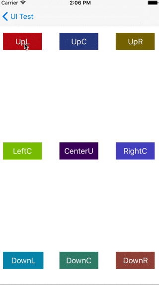

# HTMenu #

HTMenu 是一个 menu 容器，为具体显示的内容提供显示隐藏动画和位置决策  

 

## 一、特性 ##

* 支持自定义menu的位置决策	
* 支持自定义显示消失动画	
* 提供默认menu的自适应位置和默认动画
* 支持箭头位置自适应，以及自定义箭头大小

## 二、用法 ##

### 初始化位置决策器(`HTMenuLocationDecider`) ###

利用子类`HTArrowMenuLocationDecider`实现

	_decider = [[HTArrowMenuLocationDecider alloc] init];
    CGRect rect = [UIScreen mainScreen].bounds;
    //设置约束矩形，即menu的显示区域，默认为[UIScreen mainScreen].bounds
    _decider.limitBounds = CGRectMake(10, 10, rect.size.width-20, rect.size.height-20);
    //设置menu位置优先级，也可使用默认优先级
    _decider.positionPriority = @[@(HTMenuPositionLeft)];
    
### 初始化Menu(`HTMenu`) ###
	
利用子类`HTArrowBoxMenu`实现
	
	_menu = [[HTArrowBoxMenu alloc] initWithFrame:CGRectMake(0, 0, 130, 166) locationDecider:_decider];
	//设置箭头大小
	[_menu setArrowAngle:90 arrowHeight:6];

### 初始化动画(`HTMenuAnimator`) ###

利用子类`HTMenuAlphaAnimator`实现
	
	HTMenu *menu = [HTMenu alloc] init];
	_animator = [[HTMenuAlphaAnimator alloc] initWithMenu:menu];
    _animator.duration = 0.5;
	_menu.animator = animator;
	
### 添加Menu的具体显示内容 ###

	UITableView *tableView = [[UITableView alloc] init];
    tableView.dataSource = self; // liuchang datasource 考虑改成小写
    tableView.delegate = self;
    tableView.separatorStyle = UITableViewCellSeparatorStyleNone;
    tableView.backgroundColor = [UIColor clearColor];
    tableView.scrollEnabled = NO;
    [tableView registerClass:[HTImageAndTextTableViewCell class] forCellReuseIdentifier:NSStringFromClass([HTImageAndTextTableViewCell class])];
    //添加具体显示内容，如果有箭头会根据箭头调整位置和大小
    [_menu addMenuDetailView:tableView];
    
### 显示和隐藏Menu ###
	
	//注意：FromRect的位置信息是相对于[UIScreen mainScreen].bounds而设置的
	[_menu showFromRect:CGRect(100,100,50,50)];
	//可以使用UIView+HTMenu的helper接口
	- (void)showMenu:(HTMenu *)menu
	//外部调用hide
	[_menu hide];
	//HTArrowBoxMenu默认提供显示在window上面，并且提供点击空白位置隐藏menu的功能
		
## 三、注意事项 ##

* 如果使用默认的`HTArrowMenuLocationDecider`,要求limitBounds区域必须包含fromRect区域

