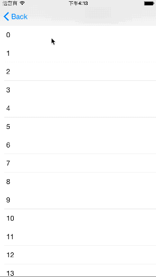
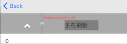
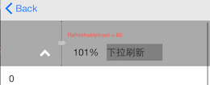
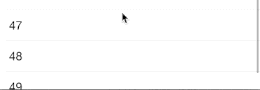
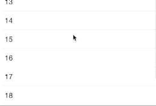
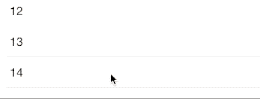
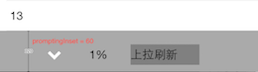
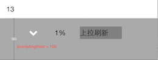
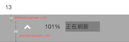
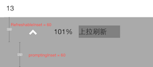

# HTRefreshView #

HTRefreshView 提供 ScrollView 的刷新功能。




## 一、特性 ##

* 提供 ScrollView 上下左右四个方向的刷新
* 可自定义刷新控件的样式
* 提供三种底部/右部刷新的触发模式
* 提供多种刷新状态，可自定义不同状态下样式及操作


## 二、用法 ##

### 上部/左部刷新 ###

#### 创建自定义子类 ####

1. 继承 `HTTopLeftRefreshView` 。

1. 复写 `loadSubViews` 方法，在该方法内自定义刷新视图样式。

   	```
	- (void)loadSubViews {
	  // 添加subviews，就像平常写 view 一样，subviews 可采用 autolayout 布局，或在 layoutSubviews 中布局
	  UIView *customView = [[UIView alloc] init];
	  [self addSubview:customView];
	}
	```

1. 复写 `refreshingInset` 方法。

   	```
	- (CGFloat)refreshingInst {
	  return 60.0;
	}
	```
 
	返回的数值表示：正在刷新时，scrollView content 相对起始位置的偏移，如下图：

   	

1. 复写 `refreshableInset` 方法。

   	```
	- (CGFloat)refreshableInset {
	    return 80;
	}
	```

	返回的数值表示：拖动 scrollView content 多少 points 时，可触发刷新(可理解为触发刷新的门限)，如下图所示

   	

1. 可选择复写 `refreshStateChanged:` 方法，获取刷新的不同状态，各种状态的含义请参考 HTRefreshState 注释 及 demo。

   	```
	- (void)refreshStateChanged:(HTRefreshState)state {
	    switch (state) {
	        // 根据 state 不同，可自定义刷新视图样式和操作
	    }
	}
	```

1. 可选择复写 `refreshPercentChanged:offset:direction:` 方法，获取 scrollView content 当前偏移起始位置的距离与触发刷新的门限的比值。可参考本文起始处 gif 中展示的百分比。

   	```
	- (void)refreshPercentChanged:(CGFloat)percent
                               offset:(CGFloat)offset
                            direction:(HTRefreshDirection)direction {
	    // 可根据 percent 值进行自定义操作，例如动画相关
	}
	```


#### 使用自定义刷新子类 ####

1. `HTTopLeftRefreshView` 的子类已定义完毕，现在 viewController 中新建此子类的一个实例。

   	```
	_refreshView = [[HTTopLeftRefershViewSubclass alloc] initWithScrollView:_tableView
                                                                      direction:HTRefreshDirectionTop
                                                               followScrollView:YES];
	```
	
1. 调用 addRefreshingHandler: 添加触发刷新后的操作

	```
	[_topRefreshView addRefreshingHandler:^(HTRefreshView *_topRefreshView){
	    // 添加自定义刷新操作
	    [weakSelf.refreshView endRefresh:YES]; // 自定义刷新操作完成后，需调用 endRefresh: 方法
    	}];
	```

1. 为 refreshView 设置 bounds/size。

	```
	_refreshView.bounds = CGRectMake(0, 0, _tableView.bounds.size.width, 80);
	```


### 底部/右部刷新 ###

底部/右部刷新提供了三种触发刷新的模式，HTTriggerLoadMoreModeAutoTrigger、HTTriggerLoadMoreModeDoNotTrigger 和 HTTriggerLoadMoreModeDraggingTrigger，在介绍使用方法前，需先了解三种模式的区别：

* HTTriggerLoadMoreModeAutoTrigger

  当 scrollView 滚动到底部/右部边缘时，自动触发刷新操作，无需手动拉动 scrollView 进行刷新。如下图：

  

* HTTriggerLoadMoreModeDraggingTrigger

  这种模式与下拉/左拉刷新触发刷新相同。即当 scrollView 滚动到底部/右部边缘时，需手动继续拉动 scrollView 触发刷新。如下图：

  

* HTTriggerLoadMoreModeDoNotTrigger

  当 scrollView 滚动到底部/右部边缘时，只是展示出刷新视图，不进行任何刷新操作(即使手动拉动 scrollView 也无法触发刷新)，如何触发刷新完全由用户定义。如下图：

  

了解上述三种模式后，让我们看一下使用底部/右部刷新的方法：


#### 创建自定义子类 ####

1. 继承 `HTBottomRightRefreshView` 。

1. 复写 `loadSubViews` 方法，在该方法内自定义刷新视图样式。

   	```
	- (void)loadSubViews {
	  // 添加subviews，就像平常写 view 一样，subviews 可采用 autolayout 布局，或在 layoutSubviews 中布局
	  UIView *customView = [[UIView alloc] init];
	  [self addSubview:customView];
	}
	```

1. 复写 `promptingInset` 方法。

   	```
	- (CGFloat)promptingInset {
	  return 60.0;
	}
	```

   	返回的数值表示：当 scrollView 滚动到底部/右部时，scrollView 底部/右部应该留多少空白来展示刷新视图，如下图

   	

   	

1. 如果你不打算使用 HTTriggerLoadMoreModeDraggingTrigger 模式触发刷新，则本小节中剩余方法均可忽略。

1. 复写 `refreshingInset` 方法。

   	```
	- (CGFloat)refreshingInst {
	  return 20.0;
	}
	```

	返回的数值表示：正在刷新时，scrollView content 相对起始位置的偏移，如下图：

   	

1. 复写 `refreshableInset` 方法。

   	```
	- (CGFloat)refreshableInset {
	    return 60;
	}
	```

	返回的数值表示：拖动 scrollView content 多少 points 时，可触发刷新(可理解为触发刷新的门限)，如下图所示

	

1. 可选择复写 `refreshStateChanged:` 方法，获取刷新的不同状态，各种状态的含义请参考 HTRefreshState 注释 及 demo。

   	```
	- (void)refreshStateChanged:(HTRefreshState)state {
	    switch (state) {
	        // 根据 state 不同，可自定义刷新视图样式和操作
	    }
	}
	```

1. 可选择复写 `refreshPercentChanged:offset:direction:` 方法，获取 scrollView content 当前偏移起始位置的距离与触发刷新的门限的比值。可参考本文起始处 gif 中展示的百分比。

   	```
	- (void)refreshPercentChanged:(CGFloat)percent
                               offset:(CGFloat)offset
                            direction:(HTRefreshDirection)direction {
	    // 可根据 percent 值进行自定义操作，例如动画相关
	}
	```


#### 使用自定义刷新子类 ####

1. `HTBottomRightRefreshView` 的子类已定义完毕，现在 viewcontroller 中新建此子类的一个实例。

   	```
	_bottomRefreshView = [[HTBottomRightRefreshViewSubclass alloc] initWithScrollView:_tableView
                                                                                direction:HTRefreshDirectionBottom
                                                                         followScrollView:YES];
	```

1. 指定触发刷新的模式。

	```
	_bottomRefreshView.triggerLoadMoreMode = HTTriggerLoadMoreModeAutoTrigger;
	```

1. 调用 addRefreshingHandler: 添加触发刷新后的操作

	```
	[_bottomRefreshView addRefreshingHandler:^(HTRefreshView *_topRefreshView){
	    // 添加自定义刷新操作
	    [weakSelf.bottomRefreshView endRefresh:YES]; // 自定义刷新操作完成后，需调用 endRefresh: 方法
    	}];
	```
	
1. 调用 `ht_setOriginalContentInset:` 方法。

   	```
	[_tableView ht_setOriginalContentInset:UIEdgeInsetsMake(64, 0, 0, 0)];
	```

   	这里设置的值是 scrollView 未添加 HTRefreshView 刷新视图时的 contentInset。如本文起始处 gif 图中示例：tableView 的大小与屏幕大小相同，由于顶部有导航栏和状态栏，tableView 的 contentInset 的 topInset 是 64，所以这里设置 topInset 为 64；如果底部有 tabbar ，则 tableView 的 contentInset 的 bottomInset 为 tabbar 高度，故此处应该设置 bottomInset 为 tabbar 高度。

1. 为 refreshView 设置 bounds/size。

	```
	_bottomRefreshView.bounds = CGRectMake(0, 0, _tableView.bounds.size.width, 80);
	```


## 三、安装 ##

### CocoaPods ###
pod 'HTRefreshView'


## 四、系统要求 ##

iOS 7.0及以上


## 五、许可证 ##

HTRefreshView 使用 MIT 许可证，详情见 LICENSE 文件。
