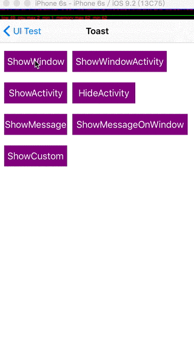

# HTToast #

toast控件，用于显示各式各样的toast。 

## 一、特性 ##

* 普通文本的toast显示
* 图文的toast显示
* 提供显示时间、位置自定义以及点击回调事件处理
* 提供传入`UIView`作为toast的显示内容
* 提供activity的显示，可与文字搭配
* 提供默认显示的全局变量配置
* 提供显示在window层的toast
* 提供自定义显示和消失动画

## 二、用法 ##

### 显示普通toast或图文toast ###
	
	//UIView的分类，可直接在view上显示toast
	[self.view makeToast:@"Something happen"
                duration:0.5
                position:HTToastPositionCenter
                   title:nil
                   image:[UIImage imageNamed:@"1-selected"]];
### 显示Activity ###
	
	//显示
	[self.view makeToastActivity];
	[self.view makeToastActivityWithMessage:@"Message测试"];
	//隐藏
	[self.view hideToastActivity];
### 显示自定义的View ###
	
	//其它扩展接口可自行使用
	[self.view showToast:toastView];
### 自定义显示和消失动画 ###
	
	//通过block来制作动画信息
		 - (void)showToast:(UIView *)toast
	showWithAnimationBlock:(animationBlock)showAnimationBlock
	hideWithAnimationBlock:(animationBlock)hideAnimationBlock;
	//block参数是当前view以及需要显示的toast
	[self.view showToast:toastView showWithAnimationBlock:^(UIView *view, UIView *toast) {
                toast.alpha = 1;
        
                CAKeyframeAnimation *showAnimation = [CAKeyframeAnimation animationWithKeyPath:@"transform"];
                showAnimation.duration = 0.4;
                showAnimation.values = @[[NSValue valueWithCATransform3D:CATransform3DMakeScale(0.01f, 0.01f, 1.0f)],
                                        [NSValue valueWithCATransform3D:CATransform3DMakeScale(1.1f, 1.1f, 1.0f)],
                                        [NSValue valueWithCATransform3D:CATransform3DMakeScale(0.9f, 0.9f, 1.0f)],
                                        [NSValue valueWithCATransform3D:CATransform3DIdentity]];
                showAnimation.keyTimes = @[@0.2f, @0.5f, @0.75f, @1.0f];
                showAnimation.timingFunctions = @[[CAMediaTimingFunction functionWithName:kCAMediaTimingFunctionEaseInEaseOut],
                                                 [CAMediaTimingFunction functionWithName:kCAMediaTimingFunctionEaseInEaseOut],
                                                 [CAMediaTimingFunction functionWithName:kCAMediaTimingFunctionEaseInEaseOut]];
                showAnimation.delegate = self;
                [toast.layer addAnimation:showAnimation forKey:nil];
    } hideWithAnimationBlock:^(UIView *view, UIView *toast) {
    	//自定义
    	.....
    }];
### 在Window上显示toast ###
	
	//显示在keyWindow上面
	[HTToast showToastWithMessage:@"HTShowMessageOnWindow"];
	[HTToast showToastWithView:toastView];
	