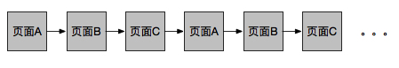
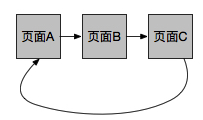
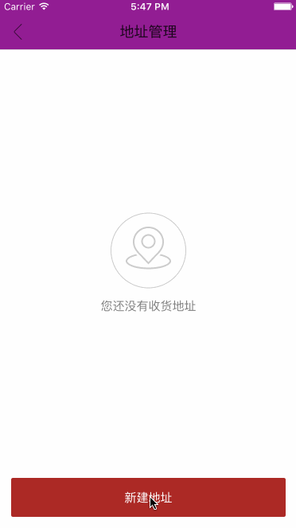
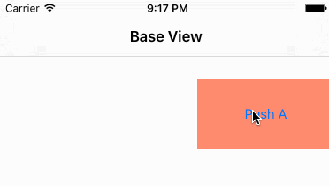
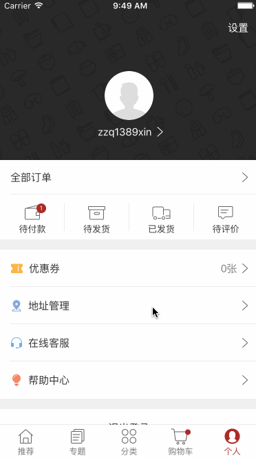
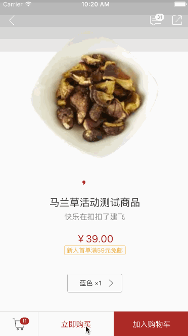
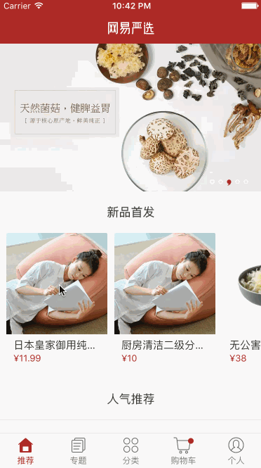
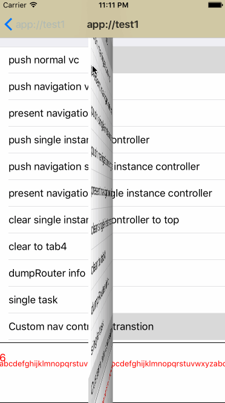

##iOS Universal Router介绍

###问题
在iOS开发中，经常碰到这样的问题：

1. 循环页面

   
   
   如何方便的描述：如果页面A已经打开了，就不用创建新的页面A，让A显示出来。
   
   
   
2. 同一个http-url链接，如果根据实际情况，自动选择使用Native或者H5打开
	
	网页中的一个标签：```<a href="http://netease.com/productdetail&productid=1">商品1</a>```
	
	当客户端还没有实现商品1的展示页面的时候（可能是早期版本），使用Web打开。
	
	当客户端实现了商品1的展示页面的时候，那么使用Native打开。

3. 前后页面导航栏不一致  
	* **页面整体移动效果：**  
   
	* **颜色不同导航栏的渐变：**  
	


###Universal Router介绍
Universal Router是一个页面导航管理的库。他主要提供如下功能：

* 通过URL作为页面标识，让native、web页面以一致的方式去打开
* 提供丰富的页面打开方式的机制，方便的处理譬如循环、单例等页面导航
* 支持常见导航栏动画、页面切换手势动画。

来看下代码大致写成什么样子：

TestController.m中申明页面的URL为app://test ：

```
+ (HTControllerRouterConfig*)configureRouter
{
    HT_EXPORT();
    
    return [[HTControllerRouterConfig alloc] initWithUrlPath:@"app://test"];
}
```

使用Push的方式打开TestController：

```
//self为某个controller的实例
[self pushViewControllerWithURL:@"app://test"];
```

###Router URL
1. 页面的URL的Scheme可以任意指定，譬如将TestController.m的URL设置成一个http url：

```
+ (HTControllerRouterConfig*)configureRouter
{
    HT_EXPORT();
    
    return [[HTControllerRouterConfig alloc] initWithUrlPath:@"http://test"];
}
```

使用Push的方式打开TestController：

```
[self pushViewControllerWithURL:@"http://test"]; //打开TestController
[self pushViewControllerWithURL:@"http://www.163.com"]; //打开Web页：www.163.com
```

每个页面的URL可以指定多个：

```
TestController.m
+ (HTControllerRouterConfig*)configureRouter
{
    HT_EXPORT();
    
    HTControllerRouterConfig *config = [[HTControllerRouterConfig alloc] initWithUrlPath:@"http://test"];
    
    [config addUrlPath:@"app://test1"];
    [config addUrlPath:@"app://test2"]
    
    return config;
}
```

使用Push的方式打开TestController：

```
[self pushViewControllerWithURL:@"app://test1"]; //打开TestController
[self pushViewControllerWithURL:@"app://test2"]; //打开TestController
```

2. URL中可以使用正则表达式：

app://product/{id:\\d+}  可以匹配：app://product/12、 app://product/123

其中大括号括起来的是一个正则表达式，id:是对这个表达式的命名，我们可以通过接口，获取匹配的结果，参考[Router Param]()

app://product/{name:[a-z]+}  可以匹配：app://product/shoe, 但是不能匹配：app://product/12

NSRegularExpression支持的表达式，这里都支持。

Universal Router的url匹配算法采用[r3](https://github.com/c9s/r3)，性能高，不需要担心因为url匹配造成的性能问题。


###Router Param
URL可以携带打开页面的参数：app://product/{id:\\d+}，被打开的页面，希望得到这些参数。
 
在TestController中，实现接口

```
- (void)receiveRoute:(HTControllerRouteParam*)param
{
    NSAssert([param.urlParam[@"id"] isEqualToString:@"12"]);
}
```

打开TestController:

```
[self pushViewControllerWithURL:@"app://product/12"]; //打开TestController
```

`receiveRouter:`接口会在Controller构建之后，viewDidLoad之前调用。

如果在Native中打开Native页面，如果信息都放在URL上，比较麻烦，也造成没有必要的消耗。通过`HTControllerRouteParam`可以传递更多丰富的信息:

```
- (void)openTestController
{
    HTControllerRouteParam *param = [[HTControllerRouteParam alloc] initWithURL:@"app://product/12" launchMode:HTControllerLaunchModePushNormal];
    param.params = @{@"key":@"value1"};
    
    [[HTControllerRouter sharedRouter] route:param];
}
```

在TestController中，这样获取参数：

```
- (void)receiveRoute:(HTControllerRouteParam*)param
{
    NSAssert([param.params[@"key"] isEqualToString:@"value1"]);
}
```

HTControllerRouteParam还可以携带更多信息，用户也可以继承出来，携带更多自定义的信息。

######消息派发
如果将页面导航的通讯机制（URL）进一步抽象，URL可以看做模块（页面）之间的通讯机制，所以Universal Router也支持到任意对象的消息传递。

###导航
我们将打开一个页面，可以分成以下两个阶段：

1. 获取页面的实例：
   * 新创建一个Controller
   * 单实例页面：如果Controller已经在显示了，就不用创建，从Controller-tree中找到实例
2. 用什么方式打开页面：
   * 可能push到navigation栈上，或者Present出来
   * 如果当前已经在Controller-tree中，那么可能是pop掉所有挡着他的Controller， 或者直接从Controller-tree中删除，然后在push上去

####导航-实例获取
打开页面第一步是要获取需要打开的Controller的实例，一般情况下有三种方式获取：

1. 创建实例：最简单、最常见的方式
2. 单实例：整个应用生命周期内，只会创建一次
3. 单任务：如果Controller已经在Controller-tree中，并且处于根Controller到当前显示的Controller的路径上，那么不创建，否则创建新实例。他一般用于处理Controller循环打开的问题。

下面的代码演示使用Router取得打开页面的实例：    

```
- (void)openTestController
{
   	HTControllerRouteParam *param = [[HTControllerRouteParam alloc] initWithURL:@"app://product/12" launchMode:HTControllerLaunchModePushNormal];
   	param.instanceMode = HTControllerInstanceModeNormal;//指定实例获取的方式
   
   	[[HTControllerRouter sharedRouter] route:param];
}
```

通过HTControllerRouteParam中的instanceMode来指定页面实例获取的方式，instanceMode的定义如下

```
//vc的实例如何构造
typedef NS_ENUM(NSInteger, HTControllerInstanceMode){
    HTControllerInstanceModeDefault,
    HTControllerInstanceModeNormal,
    HTControllerInstanceModeSingleInstance,
    HTControllerInstanceModeSingleTask, //当present vc tree上存在一个实例时，使用这个实例
};
```

如果上面三种方式都不能满足项目需求，在route方法调用的时候，用户可以传递一个block，他可以用于创建实例，或者对实例进行配置：

```
//可自定义页面实例方式，在block中可以获取URL对应的页面类
[router route:param handler:
 ^UIViewController * (Class findVCClass, id findVC, HTControllerRouteParam * usedParam)
 {
     TestRouteViewController * newVC = [findVCClass new];
     return newVC;
 }];
```

block中的参数的含义如下：  
findVCClass		通过URL查找到的页面类
findVC			在单实例或单任务的情况返回已经存在的实例，否则一直为空。
usedParam		在页面上生效的HTControllerRouteParam，是传入param和页面配置结合的结果。

####导航-打开方式
获取了页面实例，接下来描述如何打开他。打开的方式比较多：

1. **PushNormal**：push到最近的一个NavigationController上
	
2. **PresentNormal**  
	
3. **ClearToTop**  
例如用户购买商品结束后，清空首页上面的所有页面，将首页显示在最上面。
	
4. **MoveToTop**  
打开页面的过程：[主页]->[商品详情]->[购物车]->[商品详情]    
交互需要：如果购物车是从商品详情打开的，那么从购物车打开商品详情，相当于把已经打开的商品详情页删掉，然后重新打开。

[主页]->[商品详情]->[购物车]->[商品详情]  

变成了

[主页]->[购物车]->[商品详情] 

	
	

通过HTControllerRouteParam中的launchMode以及singleInstanceShowMode来指定页面打开方式：

```
- (void)openTestController
{
   	HTControllerRouteParam *param = [[HTControllerRouteParam alloc] initWithURL:@"app://product/12" launchMode:HTControllerLaunchModePushNormal];
   	param.launchMode = HTControllerLaunchModePush;
   
   	[[HTControllerRouter sharedRouter] route:param];
}
```


####导航-webview、跨APP

*	web页面链接URL规则匹配时，升级跳转到native页面

```
+ (HTControllerRouterConfig*)configureRouter
{
    HT_EXPORT();
    
    return [[HTControllerRouterConfig alloc] initWithUrlPath:@"http://netease.com/productdetail"];
}
```

*	演示一个从js调到native的route 对象的方法，并得到返回值


####导航栏设置机制
* **页面整体移动效果：**  
   
   

实现代码如下：

```
HTControllerRouteParam *param = [[HTControllerRouteParam alloc] initWithURL:[self urlPath] launchMode:HTControllerLaunchModePushNavigation];
[[HTControllerRouter sharedRouter] route:param];
```

`HTControllerLaunchModePushNavigation`方式会将页面包裹在navigation controller中push出来，页面结构如下：

```
<NavigationController (NavigationBarHide)>    //导航栏隐藏的navigation controller
   | <ContainerViewController (Container A)>  //包裹navigation controller
   |    | <NavigationController (Container A)>//放置navigation bar
   |    |    | <AViewController>			    //页面A
   | <ContainerViewController (Container B)>  //包裹navigation controller
   |    | <NavigationController (Container B)>//放置navigation bar
   |    |    | <BViewController>   			//页面B
```

* **不同导航栏颜色渐变：**

	

实现代码如下：

```
- (void)viewWillAppear:(BOOL)animated
{
    [super viewWillAppear:animated];
    UINavigationBar * navBar = self.navigationController.navigationBar;
    [navBar setTranslucent:YES];
	//这里判断一下如果是self.presentingVC不为空并且navController的rootViewController，说明当前VC是present过来的，如果加动画会看到NavBar展开的奇怪过程
    if (self.presentingViewController!=nil || ([[self.navigationController childViewControllers] firstObject] == self && [self isMovingToParentViewController])) {
    	[navBar setBarTintColor:navigationBarColor];
    } else {
        [[self transitionCoordinator] animateAlongsideTransition:^(id<UIViewControllerTransitionCoordinatorContext> context) {
    		[navBar setBarTintColor:navigationBarColor];
        } completion:nil];
    }
}
-(void)viewDidAppear:(BOOL)animated
{
    [super viewDidAppear:animated];
    //在交互返回取消时正确设置
    UINavigationBar * navBar = self.navigationController.navigationBar;
    [navBar setTranslucent:YES];
    [navBar setBarTintColor:navigationBarColor];
}
```
####页面导航动画

Router使用HTNavigationCustomTransitionDelegate修改转场动画，只需要为此类的实例设置动画类即可  

```
//设置push动画类
[self.navDelegate setPushTransitionClass:pushTransitionClass];
//设置点击返回按钮的动画类
[self.navDelegate setPopHitTransitionClass:popHitTransitionClass]
//设置手势返回的动画类
[self.navDelegate setPopInteractiveTransitionClass:popInteractiveTransitionClass];
```
**自定义导航动画**  


####拓展
上文提到，URL可以成模块间通信的机制。 基于这样的通信机制，我们可以比较方便实现应用的插件化。
